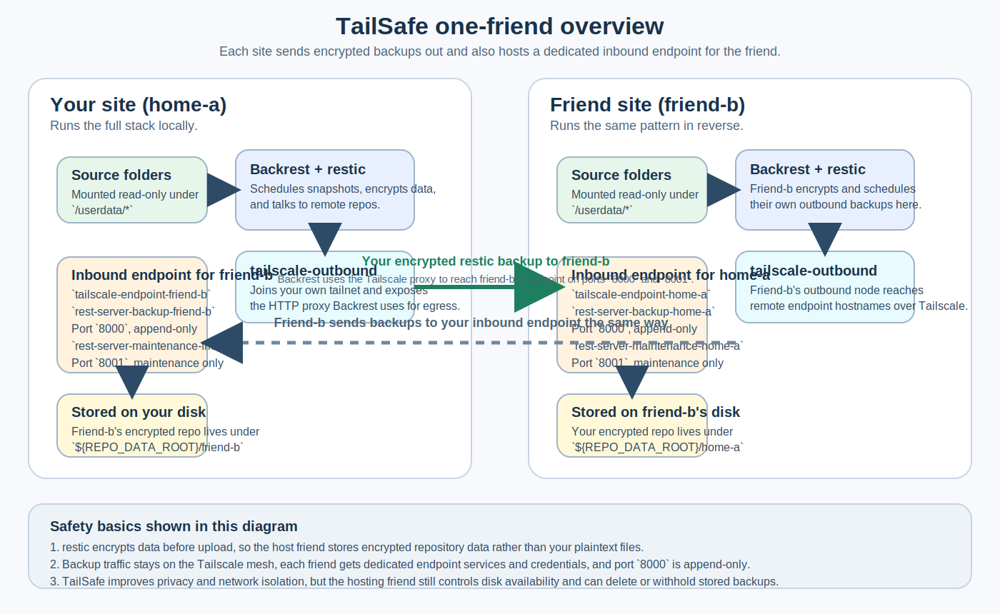

# TailSafe

TailSafe is a container-based friend-to-friend offsite backup project for Synology systems.

It helps two friends run offsite backups without exposing backup endpoints on the public internet. TailSafe combines Tailscale, Backrest, restic, and rest-server into a deployment where each site both sends encrypted backups out and hosts a dedicated inbound endpoint for the friend.

## Start here

- First real deployment with a friend: [Agent-assisted install](docs/agent-install.md)
- Mirrored, long-form walkthrough: [Setup guide](docs/setup-guide.md)
- Full field reference: [Configuration](docs/configuration.md)
- Tailscale, ACL, and runtime topology details: [Networking](docs/networking.md)
- Restore and recovery steps: [Restore playbook](docs/restore-playbook.md)

If this is your first live TailSafe pair, do not start with Quickstart. Use [Agent-assisted install](docs/agent-install.md) first.

## One-friend model



In a one-friend rollout, each site runs the full TailSafe stack locally:

- one `tailscale-outbound` node on its own tailnet
- one `backrest` instance that reads local source folders and pushes backups through the outbound Tailscale proxy
- one generated inbound endpoint trio per friend: `tailscale-endpoint-<peer>`, `rest-server-backup-<peer>`, `rest-server-maintenance-<peer>`
- one repository subdir per inbound peer under `${REPO_DATA_ROOT}`
- separate credentials for outbound traffic and inbound traffic

The model is symmetric: you back up to your friend, and your friend can back up to you, but the keys, hostnames, and HTTP credentials for those two directions are intentionally different.

## Why backing up to a friend's site can still be safe

TailSafe is not trustless cloud storage, but it can still be a sensible friend-to-friend offsite model when you want privacy plus simple operations:

- restic encrypts data before it leaves your side, so the hosting friend stores an encrypted repository rather than your plaintext files
- `RESTIC_REPOSITORY_PASSWORD` is not part of the normal friend exchange
- backup traffic stays on the Tailscale mesh instead of exposing rest-server ports on the public internet
- each inbound friend gets a dedicated endpoint hostname, dedicated HTTP credentials, and a separate repository subdir
- the backup listener on port `8000` is append-only; destructive maintenance uses a separate listener on port `8001` with separate credentials

Important limit: the hosting friend still controls the machine and disk. They can delete, withhold, or corrupt stored backup data, so TailSafe improves confidentiality and network isolation a lot compared to a plain shared folder, but it does not remove trust in the storage host.

## What you exchange with a friend

For each friend relationship, keep the direction of the values straight:

| Category | Values |
| --- | --- |
| Send to your friend | endpoint auth key you issued for their endpoint node on your tailnet, endpoint hostname they should target, backup HTTP user/password, maintenance HTTP user/password |
| Receive from your friend | endpoint auth key they issued for your endpoint node on their tailnet, remote endpoint hostname/FQDN, remote backup HTTP user/password, remote maintenance HTTP user/password |
| Never exchange | `TS_OUTBOUND_AUTHKEY`, `RESTIC_REPOSITORY_PASSWORD`, host path roots, local bind-port choices |

The two most common first-run mistakes are mixing up outbound vs inbound credentials, and confusing your endpoint hostname with the friend's endpoint hostname. The mirrored examples in [Setup guide](docs/setup-guide.md) walk through both sides end to end.

## What it ships

- GHCR-hosted runtime images
- an example base Compose deployment plus a generated endpoint fragment
- generators for Backrest `backrest-config.json`, `compose.endpoints.yaml`, and per-peer `tailscale-serve-<peer>.json` Serve configs
- helper scripts for local preflight checks (source paths and required secrets) and REST auth material
- operator docs for setup, restore, and troubleshooting

Only the TailSafe-owned configurator image is UBI-based right now. Tailscale runs from the official `tailscale/tailscale` container directly; Backrest and rest-server images remain thin wrappers around their upstream images.

## What it does not ship

- live deployment to your Synology
- committed site secrets
- committed production Compose files
- Tailscale ACL policy for your tailnets

## Prerequisites

`mise run ci` requires [mise](https://mise.jdx.dev/) and Docker with Compose support.

If this is your first real deployment with a friend, start with [Agent-assisted install](docs/agent-install.md).

## Quickstart (after friend coordination)

This quickstart assumes you already understand the TailSafe model, have exchanged the required friend values, and know which host paths you want to use.

1. Create the host directories you will bind into the stack. A Synology-style example looks like:

   ```bash
   mkdir -p /volume1/tailsafe/backrest /volume1/tailsafe/repos /volume1/tailsafe/state /volume1/tailsafe/userdata
   ```

2. Copy the example deployment files:

   ```bash
   cp deploy/compose.example.yaml deploy/compose.yaml
   cp config/site.one-friend.example.json config/site.json
   cp env.one-friend.example .env
   ```

3. Edit `.env` and `config/site.json`. For a first pair, the important split is:

   - one local-only outbound Tailscale auth key (`TS_OUTBOUND_AUTHKEY`)
   - one endpoint auth key and hostname per inbound friend (`TS_ENDPOINT_AUTHKEY_<PEER>`, `TS_ENDPOINT_HOSTNAME_<PEER>`)
   - one outbound HTTP password pair per remote TailSafe stack (`TAILSAFE_REMOTE_*`)
   - one inbound HTTP password pair per inbound peer (`TAILSAFE_INBOUND_*`)
   - the restic encryption password you keep locally (`RESTIC_REPOSITORY_PASSWORD`)
   - the GHCR image namespace (`TAILSAFE_IMAGE_NAMESPACE`) and pinned image tag (`TAILSAFE_VERSION`)

   In `config/site.json`, source paths should point at `/userdata/...` because Compose mounts `${USERDATA_ROOT}` at `/userdata` inside the containers.

   See [Configuration](docs/configuration.md) for the full `outboundRemotes[]`, `inboundPeers[]`, and `sources[].destinationIds[]` model, including how inbound and outbound credentials are coordinated independently.

4. Generate the runtime assets:

   ```bash
   docker compose --env-file .env -f deploy/compose.yaml up configurator --force-recreate
   ```

5. Confirm `${BACKREST_DATA_ROOT}/generated/` now contains at least:

   - `backrest-config.json`
   - `compose.endpoints.yaml`
   - `tailscale-serve-<peer>.json`
   - the peer-specific htpasswd files

6. Start the long-lived services with the generated endpoint fragment from your real Backrest data path. With the example `BACKREST_DATA_ROOT=/volume1/tailsafe/backrest`, that looks like:

   ```bash
   docker compose --env-file .env \
     -f deploy/compose.yaml \
     -f /volume1/tailsafe/backrest/generated/compose.endpoints.yaml \
     up -d
   ```

7. Open Backrest at [http://127.0.0.1:9898](http://127.0.0.1:9898), wait for the Tailscale nodes to finish connecting, then trigger one manual backup before relying on schedules.

See [Configuration](docs/configuration.md) for the full `site.json` model and [Deployment ownership](#deployment-ownership) for which files stay on the host.

## Local workflow

Use `mise run ci` to validate the repository.
Use `mise run check:release` as the pre-release validation entrypoint before tagging or publishing images.
For a first pair, start from the one-friend examples in Quickstart. Use `env.example` and `config/site.example.json` when you need the advanced multi-friend reference layout.
All CI/CD helper scripts live under `.cicd/scripts/`.

## Documentation

- [Agent-assisted install](docs/agent-install.md) — primary first-install runbook for agents and first-time operators
- [Setup guide](docs/setup-guide.md) — one-friend rollout rationale and mirrored your-side / friend-side walkthrough
- [Configuration](docs/configuration.md) — user-owned files, required secrets, and the `site.json` model
- [Networking](docs/networking.md) — outbound and endpoint Tailscale roles, rest-server ports, and UI exposure
- [Restore playbook](docs/restore-playbook.md) — folder restores, VolSync repository recovery, and maintenance troubleshooting

## Deployment ownership

TailSafe publishes images and examples. You own the real deployment files used at each site:

- `deploy/compose.yaml` — your site-local Compose stack (copy from `deploy/compose.example.yaml`)
- `.env` — secrets and path configuration (copy from `env.one-friend.example` for a first pair, or `env.example` for multi-friend layouts)
- `config/site.json` — schedules, sources, outbound remotes, inbound peers, and Healthchecks.io URLs (copy from `config/site.one-friend.example.json` for a first pair, or `config/site.example.json` for multi-friend layouts)
- `${BACKREST_DATA_ROOT}/generated/` — generated runtime assets, including `compose.endpoints.yaml`, per-peer `tailscale-serve-<peer>.json` Serve configs, htpasswd files, and `backrest-config.json`

Keep production copies on the host or in private storage; do not commit them to this repository.
